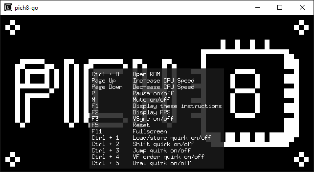

# pich8-go

A cross-platform CHIP-8, SUPER-CHIP and XO-CHIP interpreter written in Go

Ported from my original Rust [pich8](https://github.com/philw07/pich8) interpreter.  
The goal was give Go a try, I had no prior experience.

## Screenshot



## Key Mapping

As with most other emulators, the keys are mapped as follows.  
On other keyboard layouts it should be the same keys (not the same characters) as the keys are determined by scancode.

```
    Keyboard                     CHIP-8
┌───┬───┬───┬───┐           ┌───┬───┬───┬───┐
│ 1 │ 2 │ 3 │ 4 │           │ 1 │ 2 │ 3 │ C │
├───┼───┼───┼───┤           ├───┼───┼───┼───┤
│ Q │ W │ E │ R │           │ 4 │ 5 │ 6 │ D │
├───┼───┼───┼───┤     →     ├───┼───┼───┼───┤
│ A │ S │ D │ F │           │ 7 │ 8 │ 9 │ E │
├───┼───┼───┼───┤           ├───┼───┼───┼───┤
│ Z │ X │ C │ V │           │ A │ 0 │ B │ F │
└───┴───┴───┴───┘           └───┴───┴───┴───┘
```

## Build

On Linux, following packages are required.

```
$ sudo apt-get install -y libgl1-mesa-dev xorg-dev libasound2-dev
```

Afterwards the build can simply be done using go.

```
$ go build
```

To hide the console window on Windows, use the following command.

```
> go build -ldflags -H=windowsgui
```
